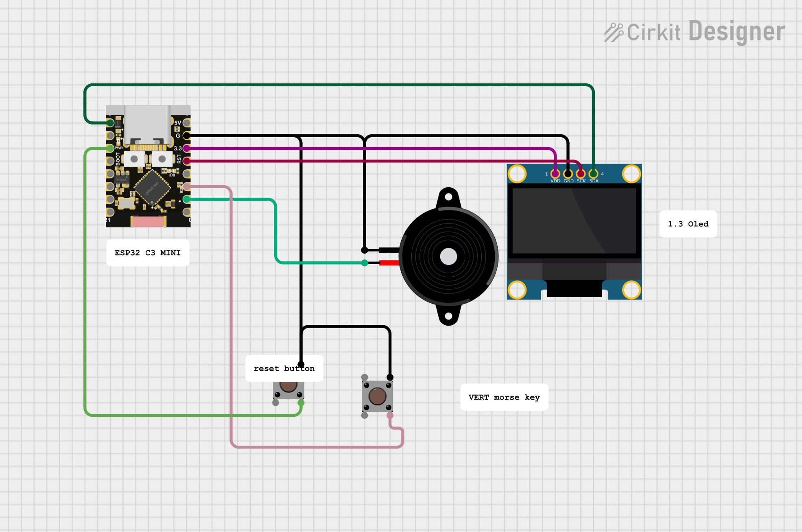

# ESP32_C3_MINI_MORSE_TRAINER  
## Vertical Keyer + CW Decoder with ESP32-C3 Mini  

**Author:** LU6APR Pablo Ramos  

---

## 1. PROJECT DESCRIPTION  

This project consists of building a **Vertical Keyer** (traditional Morse key) with an integrated Morse code decoder, based on the **ESP32-C3 Super Mini** microcontroller.  

The device allows you to:  

- Transmit Morse code using a **vertical key** (single button/lever)  
- Automatically decode the transmitted Morse code  
- Display the decoded text on an **OLED screen (4 lines)**  
- Automatic spacing after 1 second of pause  
- Manual clearing with a short button press  

---

## 2. CIRCUIT IMAGE  

---

## 3. SETUP AND UPLOAD  

1. Copy the code into the **Arduino IDE**  
2. Select the corresponding port  
3. Choose the **ESP32-C3 Mini** board (I used **LOLIN C3 MINI**)  
4. Compile and upload to the ESP32-C3 Mini  

---

## 4. IMPORTANT NOTE  

The project can also be built **without the OLED screen**, still functioning as a **Morse code oscillator** for a vertical key (straight key).  

---

## 5. DIFFERENCES FROM THE IAMBIC VERSION  

| Feature                | Iambic version (original)     | Vertical version (this)        |
|------------------------|-------------------------------|--------------------------------|
| Key type               | Iambic paddle (two levers)    | Vertical key (single button)   |
| Keyer logic            | Mode A or B (iambic)           | Straight mode (simple press)   |
| Decoding               | Yes                            | Yes                            |
| WPM adjustment         | Yes                            | Yes                            |

---

## 6. CASE
https://www.printables.com/model/1751233-case-cw-trainer-for-vertical-or-iambic-key

## 7. AUTHOR AND LICENSE  

**LU6APR Pablo Ramos**  
Open source project.  

